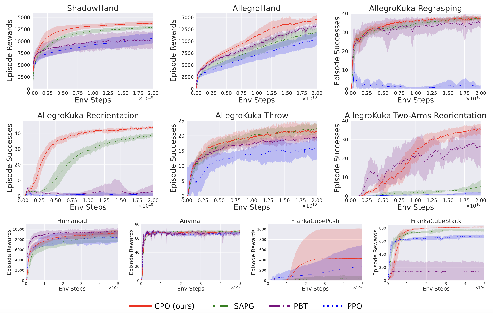

# CPO: Rethinking Policy Diversity in Ensemble Policy Gradient in Large-Scale Reinforcement Learning

Authors: Naoki Shitanda, Motoki Omura, Tatsuya Harada, Takayuki Osa \
Accepted at **ICLR 2026 (Poster)**

This repository contains the official implementation for the algorithm CPO, prposed in [***Rethinking Policy Diversity in Ensemble Policy Gradient in Large-Scale Reinforcement Learning***](https://openreview.net/forum?id=gRdEcs0qdd).

## Performance



## Key Implementation Points

We provide the implementation of our proposed method, CPO. The code is based on the [SAPG](https://github.com/jayeshs999/sapg) codebase. Highlights of the implementation are as follows:


- ### Data Handling for Leader-Follower Framework  
  The leader-follower framework is implemented by conditioning a shared policy network on agent-specific vectors. Off-policy sampling between the leader and follower agents is realized by duplicating the collected trajectories and modifying their conditioning vectors, along with creating label masks, via the `augment_batch_for_cpo` function.

  **Implemented in:**  
  `rl_games/rl_games/common/a2c_common.py`, function `augment_batch_for_cpo()`


- ### Loss Calculation  
  Policy loss computation for CPO is implemented in the `actor_loss_cpo` function. This function receives data with label masks and computes each loss component (e.g., PPO loss for the leader update, PPO loss with KL constraint and AWAC loss for the follower updates) before applying the mask and averaging only over the relevant samples.

  **Implemented in:**  
  `rl_games/rl_games/common/common_losses.py`, function `actor_loss_cpo()`


- ### Adversarial Reward  
  An adversarial reward is computed from a discriminator that distinguishes between agents based on their state-action pairs. After calculating this reward and updating returns and values, the discriminator is trained.

  **Implemented in:**  
  `rl_games/rl_games/common/a2c_common.py`, function `play_steps()` of class `A2CBase`


## Quickstart
Clone the repository and create a Conda environment using the ```env.yaml``` file.
```bash
conda env create -f env.yaml
conda activate cpo
```

Download the Isaac Gym Preview 4 release from the [website](https://developer.nvidia.com/isaac-gym) and executing the following after unzipping the downloaded file
```bash
cd isaacgym/python
pip install -e .
```

Now, in the root folder of the repository, execute the following commands,
```bash
cd rl_games
pip install -e . 
cd ..
pip install -e .

export LD_LIBRARY_PATH=<CONDA PATH i.e. anaconda3-2023.03>/envs/cpo/lib
```

### Reproducing performance
 
We provide the exact commands which can be used to reproduce the performance of policies trained with CPO on different environments.

```bash
# Shadow Hand
./scripts/train.sh shadow_hand "test" 1 24576 [] --cpo --num-expl-coef-blocks=6 --wandb-entity <ENTITY_NAME> --ir-type=entropy --ir-coef-scale=0.005 --extra-args "train.params.config.awac_beta=0.01 train.params.config.ad_reward_coef=0.01"

# Allegro Hand
./scripts/train.sh allegro_hand "test" 1 24576 [] --cpo --num-expl-coef-blocks=6 --wandb-entity <ENTITY_NAME> --ir-type=none --extra-args "train.params.config.awac_beta=0.0005 train.params.config.lambda_awac=0.1 train.params.config.ad_reward_coef=0.001"

# Allegro Kuka Regrasping
./scripts/train_allegro_kuka.sh regrasping "test" 1 24576 [] --cpo --lstm --num-expl-coef-blocks=6 --wandb-entity <ENTITY_NAME> --ir-type=none --extra-args "train.params.config.awac_beta=0.001"

# Allegro Kuka Reorientation
./scripts/train_allegro_kuka.sh reorientation "test" 1 24576 [] --cpo --lstm --num-expl-coef-blocks=6 --wandb-entity <ENTITY_NAME> --ir-type=entropy --ir-coef-scale=0.005 --extra-args "train.params.config.awac_beta=0.001"

# Allegro Kuka Throw
./scripts/train_allegro_kuka.sh throw "test" 1 24576 [] --cpo --lstm --num-expl-coef-blocks=6 --wandb-entity <ENTITY_NAME> --ir-type=none --extra-args "train.params.config.awac_beta=0.001 train.params.config.lambda_awac=0.1"
```


## Acknowledgements
This implementation builds upon the the following codebases - 
1. [SAPG](https://github.com/jayeshs999/sapg)
2. [IsaacGymEnvs](https://github.com/isaac-sim/IsaacGymEnvs)
3. [rl_games](https://github.com/Denys88/rl_games)

